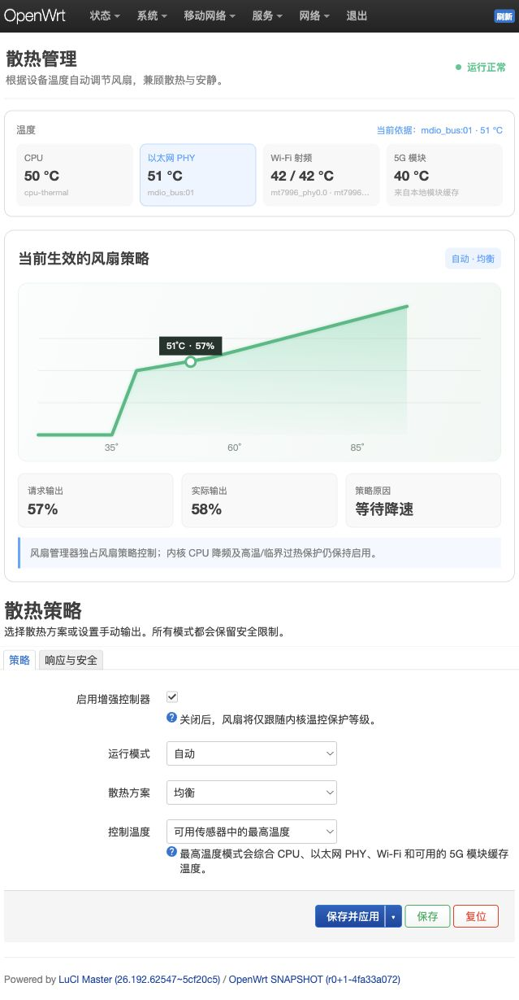

# H5000M Fan Control

[](https://github.com/FAN789/luci-app-h5000m-fancontrol/actions/workflows/ci.yml)
[](https://github.com/FAN789/luci-app-h5000m-fancontrol/actions/workflows/release.yml)
[](LICENSE)

面向 Hiveton H5000M 的 OpenWrt LuCI 风扇管理器。它提供温度监控、自动风扇曲线、手动 PWM、启停助推、温度滞回、降速延迟和传感器故障保护，并保留内核的 CPU 降频、高温及临界过热保护。

> H5000M fan manager for OpenWrt with temperature-aware profiles, manual PWM control, hysteresis, delayed spin-down, start boost and sensor failsafe protection.

版本采用标准的 `主版本.次版本.修订版本-r打包修订` 格式。GitHub Release 仅使用
语义版本标签（当前为 `v2.0.2`），OpenWrt 安装包版本为 `2.0.2-r1`。



## 功能

- 汇总 CPU、以太网 PHY、Wi-Fi 射频及 MT5700M 管理器提供的新鲜缓存温度
- 静音、均衡、性能和自定义四种自动曲线
- 自动、手动和仅内核保护三种运行模式
- 温度滞回及降速延迟，减少风扇频繁波动
- 风扇停转后的启动助推
- 传感器或曲线异常时自动进入高输出安全模式
- 简体中文 LuCI 界面
- 不依赖云服务，不收集或上传设备数据

## 兼容性

- Hiveton H5000M
- OpenWrt SNAPSHOT（基于 LuCI JavaScript 视图）
- `pwm-fan` 驱动及 `/sys/class/hwmon/*/pwm1` 控制节点

本项目针对 H5000M 的设备树和传感器布局设计。其他设备即使能够安装，也不建议直接使用。

## 集成到 OpenWrt 源码

在 OpenWrt 源码根目录执行：

```sh
git clone https://github.com/FAN789/luci-app-h5000m-fancontrol.git \
  package/luci-app-h5000m-fancontrol

make menuconfig
# LuCI -> Applications -> luci-app-h5000m-fancontrol

make package/luci-app-h5000m-fancontrol/compile V=s
```

GitHub Releases 中的预编译 `.apk` 由 GitHub Actions 使用官方 OpenWrt
SNAPSHOT `mediatek/filogic` SDK 构建，适用于同一 ABI 的近期 SNAPSHOT。Release
同时提供构建公钥和 SHA256 校验文件。由于风扇安全策略依赖设备树，建议把本项目
集成进固件并同时评估下方补丁，而不是只安装软件包。

## 独占风扇策略控制

H5000M 原设备树中的主动散热映射会与用户空间控制器同时修改 PWM。若希望自动曲线完整控制风扇，请在编译固件前应用项目提供的补丁：

```sh
git apply package/luci-app-h5000m-fancontrol/openwrt-patches/h5000m-userspace-fan-control.patch
```

该补丁仅删除 H5000M 的三个风扇 cooling-map；CPU 降频、hot 和 critical 温控节点仍然保留。控制器还会在 CPU 达到高温阈值时强制提高风扇输出。

不应用补丁时插件仍可运行，但内核 thermal governor 可能提高实际 PWM，因此界面中的请求输出和实际输出可能不同。

## 配置与服务

- UCI 配置：`/etc/config/h5000m_fancontrol`
- procd 服务：`/etc/init.d/h5000m-fancontrol`
- 控制器：`/usr/sbin/h5000m-fancontrol`
- LuCI 页面：系统 → 风扇控制

常用命令：

```sh
/usr/sbin/h5000m-fancontrol status
/usr/sbin/h5000m-fancontrol apply
/etc/init.d/h5000m-fancontrol restart
```

## 安全说明

风扇控制属于设备安全功能。修改自定义曲线或手动 PWM 后应持续观察温度。即使启用了独占用户空间策略，也不应删除设备树中的 CPU 降频、hot 或 critical 保护。

## 许可证

[Apache License 2.0](LICENSE)
